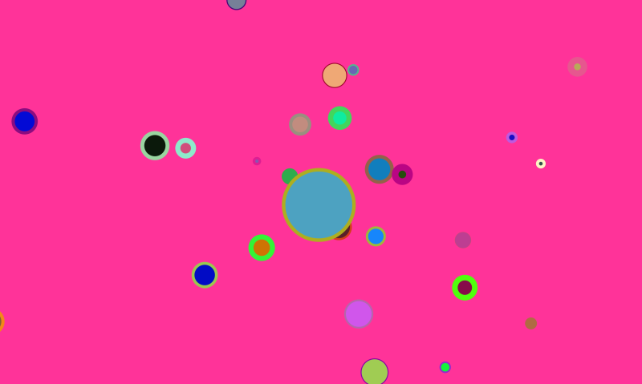

# P5_JS_Starter_Animation_2 - Earth With Many Moons

A quick implementation of attraction. Resembles moon around earth. Kind of. we dont get a perfect circular movement though.

I decided to use an array for the moon thing so we have dozens of celestial objects trying to circle the center figure.

# Files in the project

1. sketch.js - the main file where you write your code.
1. globalvariables.js - the file where I keep all global variables. Yes, in JavaScript we dont really recommend global variables. However, we are doing animation here. some rules need to be broken.
1. mover.js - where I put all the 'satellite' things. the many moons.
1. attractor.js - the center earth which 'pulls' the satellites towards it.

# References

1. https://natureofcode.com/book/chapter-2-forces/
1. https://github.com/nature-of-code/noc-examples-p5.js/tree/master/chp02_forces/NOC_2_06_attraction

# Hire Me

I work as a full time freelance software developer and coding tutor. Hire me at [UpWork](https://www.upwork.com/fl/vijayasimhabr) or [Fiverr](https://www.fiverr.com/jay_codeguy).

# Hobbies

I try to maintain a few hobbies.

1. Podcasting. You can listen to my [podcast here](https://stories.thechalakas.com/listen-to-podcast/).
1. Photography. You can see my photography on [Unsplash here](https://unsplash.com/@jay_neeruhaaku).
1. Digital Photorealism 3D Art and Arch Viz. You can see my work on this on [Adobe Behance](https://www.behance.net/vijayasimhabr).
1. Writing and Blogging. You can read my blogs. I have many medium Publications. [Read them here](https://medium.com/@vijayasimhabr).

# important note

This code is provided as is without any warranties. It's primarily meant for my own personal use, and to make it easy for me share code with my students. Feel free to use this code as it pleases you.

I can be reached through my website - [Jay's Developer Profile](https://jay-study-nildana.github.io/developerprofile)