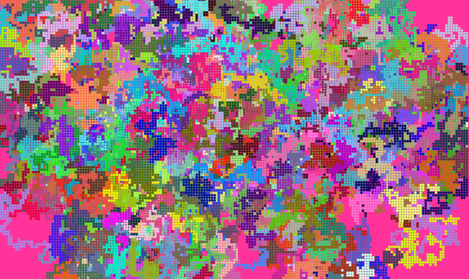

# P5 JS Workshop

I have always wanted to conduct some P5 JS workshops. This repo is code related to that.

Find more details on our [Workshop Website](https://sandkdesignstudio.in/p5-js-workshop/). Than you.

Note : All code here is borrowed from the main [P5 JS For Students Repository](https://github.com/Jay-study-nildana/P5JSForStudents).

# Projects Discussed

Note : Remember to right click, and open in new tab.

1. [Walk Wander Aimlessly](IntroductionRandomWalks) - random walk simulation which uses Perlin Noise. 
    1. [Video - Mobile Phone Version](https://vimeo.com/725522083)
    1. [Video - Desktop/Laptop Version](https://vimeo.com/725522127)
1. [So Many Balls](BallsOfManyMass) - bunch of solid balls just bouncing off the ground. 
    1. [Video - Mobile Phone Version](https://vimeo.com/725521924)
    1. [Video - Desktop/Laptop Version](https://vimeo.com/725522018)
1. [Satellites Are Coming](P5_JS_Starter_Animation_EarthWithManyMoons) - bunch of satellites attracted to the home planet. 
    1. [Video - Mobile Phone Version](https://vimeo.com/725521844)
    1. [Video - Desktop/Laptop Version](https://vimeo.com/725521904)
1. [Its Getting Bigger](Tree) - Growing trees is boring But Good To Know. Skippable.
    1. [Video - Mobile Phone Version](https://vimeo.com/725521795)
    1. [Video - Desktop/Laptop Version](https://vimeo.com/725521815)

# Hire Me

I work as a full time freelance software developer and coding tutor. Hire me at [UpWork](https://www.upwork.com/fl/vijayasimhabr) or [Fiverr](https://www.fiverr.com/jay_codeguy).

# Hobbies

I try to maintain a few hobbies.

1. Podcasting. You can listen to my [podcast here](https://stories.thechalakas.com/listen-to-podcast/).
1. Photography. You can see my photography on [Unsplash here](https://unsplash.com/@jay_neeruhaaku).
1. Digital Photorealism 3D Art and Arch Viz. You can see my work on this on [Adobe Behance](https://www.behance.net/vijayasimhabr).
1. Writing and Blogging. You can read my blogs. I have many medium Publications. [Read them here](https://medium.com/@vijayasimhabr).

# important note

This code is provided as is without any warranties. It's primarily meant for my own personal use, and to make it easy for me share code with my students. Feel free to use this code as it pleases you.

I can be reached through my website - [Jay's Developer Profile](https://jay-study-nildana.github.io/developerprofile)
